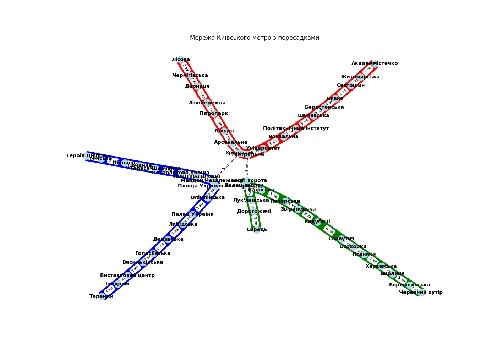

# Аналіз графу Київського метро

## Опис

Граф, що моделює транспортну мережу Київського метро, було створено за допомогою бібліотеки `networkX`. Кожна станція метро є вершиною графу, а з'єднання між станціями — це ребра графу, яким присвоєні ваги, що відображають час у хвилинах для проходження між станціями.

## Основні характеристики графу

- **Кількість вершин (станцій метро)**: 52
- **Кількість ребер (з'єднань між станціями)**: 52
- **Середній ступінь вершини**: 2.0

### Ступінь вершин

Ступінь вершини визначає кількість з'єднань для кожної станції метро. Наприклад, станції, які є пересадковими вузлами між різними лініями, мають більший ступінь, ніж кінцеві станції.

- Найвищий ступінь вершини: **3** (станції, що є пересадковими, наприклад, "Золоті ворота" та "Палац спорту").
- Найнижчий ступінь вершини: **1** (кінцеві станції, наприклад, "Академмістечко" та "Червоний хутір").

## Порівняння алгоритмів пошуку

Для аналізу графу було використано два алгоритми пошуку: пошук у глибину (DFS) та пошук у ширину (BFS). Вони були застосовані для знаходження шляхів між станціями "Академмістечко" та "Либідська".

- **DFS (пошук у глибину)** знаходить шляхи, заглиблюючись у граф, що може призводити до знаходження не найкоротшого шляху.
- **BFS (пошук у ширину)** забезпечує знаходження найкоротшого шляху в графах без ваг.

У даному графі BFS показав кращі результати для знаходження найкоротшого шляху між станціями, оскільки алгоритм DFS може випадково вибрати більш довгий шлях.

## Алгоритм Дейкстри

Було також реалізовано алгоритм Дейкстри для знаходження найкоротшого шляху між усіма вершинами графу. Цей алгоритм враховує ваги ребер, що дозволяє знайти оптимальні маршрути з урахуванням часу, необхідного для переміщення між станціями.

### Результати алгоритму Дейкстри

Для станції "Академмістечко" було знайдено найкоротші шляхи до всіх інших станцій. Наприклад:
- Відстань до станції "Хрещатик": **23 хв**.
- Відстань до станції "Либідська": **45 хв**.

## Висновки

Аналіз транспортної мережі Київського метро показав, що використання графів є ефективним підходом для моделювання та аналізу реальних мереж. Пошук у ширину (BFS) забезпечив знаходження найкоротших шляхів у графі, тоді як алгоритм Дейкстри дозволив оптимізувати маршрути з урахуванням ваги кожного ребра. Ці методи можуть бути застосовані для покращення планування маршрутів та оптимізації часу пересування в реальних умовах.
